# weeBell Hardware
weeBell is a platform designed to make it easy to (re)use old "POTS" telephones - rotary or DTMF. It is comprised of two boards - gCore and the gCore POTS shield. [gCore](https://github.com/danjulio/gCore) is a high-end ESP32 development board aimed at making portable gadgets with graphical displays. The gCore POTS shield, documented here, contains the circuitry necessary to implement a local area "line card" providing the proper signaling for traditional 2-wire telephones, including ring generation, DTMF or rotary dialing support and caller ID. You can plug a telephone directly into it or you can connect it to the existing wiring that might exist in your home or business and then plug a telephone or two into other jacks around the building.

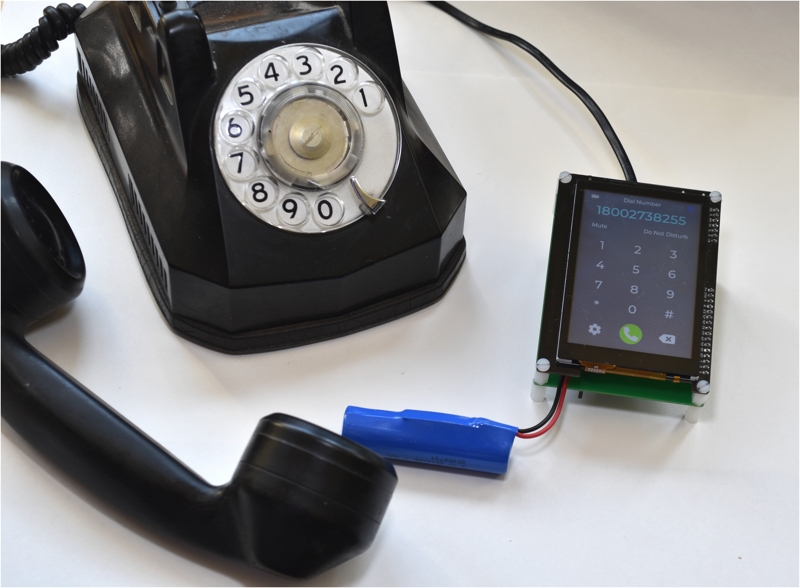

The name weeBell is a play on both small and wireless and pays homage to the granddaddy of all technology companies, AT&T or simply "Ma Bell".  In 1984 AT&T's telephone system was split into several regional telephone companies or Baby Bells as they were christened.  weeBell is an even smaller regional telephone provider...a provider for one.

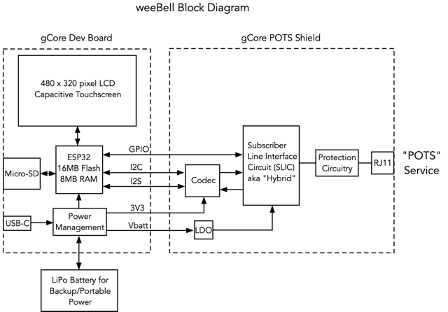

weeBell hardware may be purchased from my store on tindie.com.

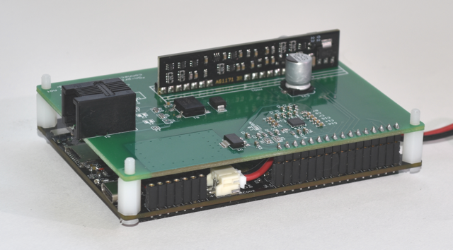

## weeBell software
Different software running on weeBell can do things like let POTS phones call and receive using a cellphone via Bluetooth, implement a SIP-based VOIP phone, or act as a functional prop in an installation of some kind.  Current software I have written includes.

1. [weeBell Bluetooth](https://github.com/danjulio/weeBell_bluetooth) - Uses the Bluetooth classic handsfree protocol to allow POTS telephones to make and receive phone calls through your cellphone.

## gCore POTS shield

The ```Documentation``` folder contains the gCore POTS shield PCB schematic and specifications for the major components.

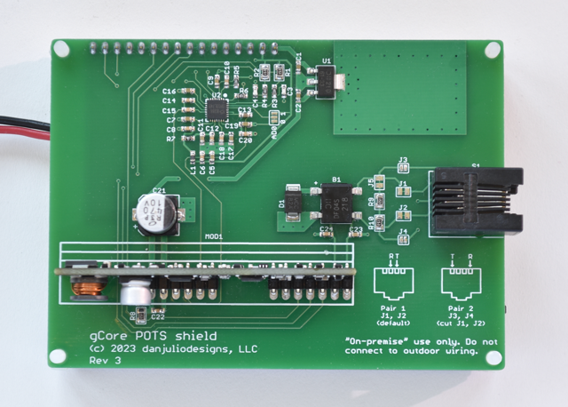

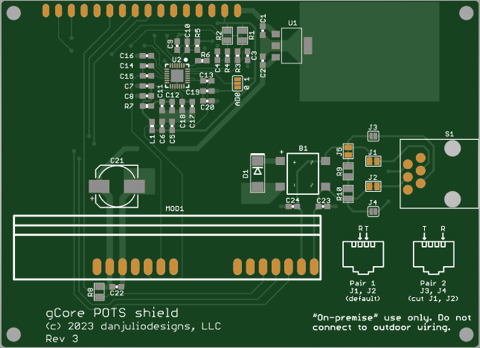

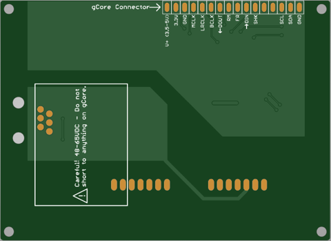

The gCore POTS shield is based around the Everest Semiconductor ES8388 audio codec and the AG1171 Ringing Subscriber Line Interface Circuit module (SLIC or Hybrid) from Silvertel corporation to interface with a 600 ohm telephone line.  The SLIC interfaces audio, generates ringing voltages and detects both off-hook and rotary dialing signaling.

### gCore POTS shield signals

The gCore POTS shield is designed to mate with gCore but can be used with other control circuits.  It requires two supplies, 3 GPIOs, an I2S interface and an I2C interface.  All logic is 3.3V.  See the specs for detailed operation of the codec and SLIC.

| Signal | Description |
| --- | --- |
| V+ | 3.5 - 5VDC @ 500 mA max supply input for AG1171 with 1 REN ringing load |
| 3.3V | Regulated 3.3VDC supply input for the ES8388 codec chip.  Minimal current consumption. |
| GND | Common ground |
| MCLK | ES8388 I2S MCLK input |
| LRCLK | ES8388 I2S LRCLK input |
| BCLK | ES8388 I2S BCLK input |
| DOUT | ES8388 I2S data input |
| DIN | ES8388 I2S data output |
| RM | AG1171 Ringing Mode input |
| FR | AG1171 Forward/Reverse input |
| SHK | AG1171 Switch Hook output |
| SDA | ES8388 I2C SDA signal |
| SCL | ES8388 I2C SCL signal |


### gCore POTS shield notes
The gCore POTS shield is fitted with a pair of resistors in parallel with the telephone signals.  These allow for on-hook transmission of audio used by some caller ID systems.  These resistors slightly increase power consumption and may be disconnected by cutting the trace between the pads of jumper J5.

The Tip and Ring signals are connected to the center pair of signals (pins 3 and 4) in the RJ11 connector by default.  They may be connected to the next pair (pins 2 and 5) by using a soldering iron and solder to bridge jumpers J3 and J4.  The traces between pads on jumpers J1 and J2 should be cut to disconnect the signals from the center pair.  This feature is useful for the case where you want to connect weeBell to existing building wiring but the center pair are already in use.  There are adapters such as the one shown below which map different pairs to the center pair for a phone to plug into.

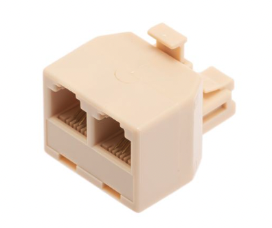

The gCore POTS shield contains the recommended protection circuitry for short loop on-premise use, meaning telephone wiring within a building.  This allows weeBell to connect to existing house wiring, for example enabling phones to be used in different rooms.  It is very important, however, to ensure that outside wiring such as that connecting to lines going back to a central office are disconnected.  Otherwise nearby lightening will probably damage weeBell.  Silvertel recommends a 1 km max line length.

The AG1171 is specified with a 1 REN load.  It may be capable of driving heavier ringing loads but current consumption from the V+ terminal will increase.  I've tested with one traditional electro-mechanical bell and one electronic bell at the same time.

Typical current consumption is about 100 mA when all phones are on-hook.  Current consumption rises up to 450-500 mA when a phone is off-hook and/or ringing.

## gCore Modifications
You will need to solder a 16-position 2.54 mm female socket (6.1 mm body height) such as the Preci-Dip [801-87-016-10-001101](https://www.mouser.com/ProductDetail/437-8018701610001101) to gCore's IO expansion port as shown below.

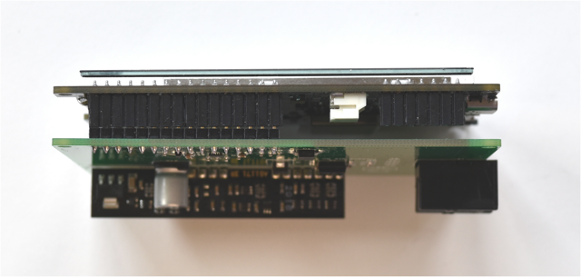

You'll also need a 3.7V Li-Ion battery.  The enclosure is designed for a [single 18650](https://www.digikey.com/en/products/detail/adafruit-industries-llc/1781/5054543) cell using a the standard Adafruit/Sparkfun JST connector (be careful, some batteries come with reversed polarity on these connectors).  You can also construct a battery using a 18650 cell and [cable assemblies](https://www.adafruit.com/product/261) from Adafruit.

## weeBell 3D printed enclosure
The ```enclosure``` folder contains an enclosure design created with OpenSCAD for printing on an FDM printer.  It includes source as well as STL files for the four pieces that make up the enclosure.

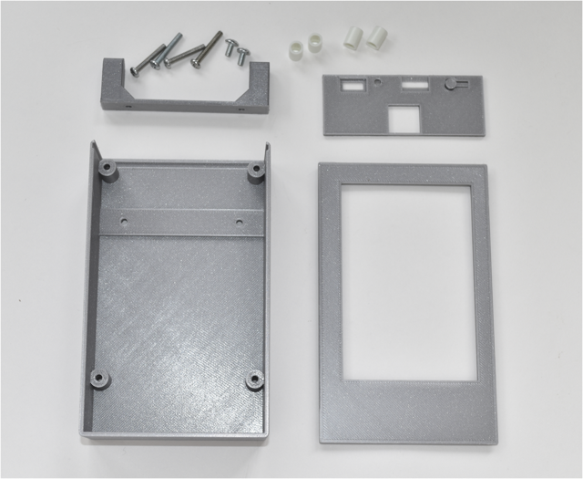

In addition the the printed parts the enclosure uses the following hardware.

1. 4x M3 x .5 thread, 20 mm long screws.  I have used both metal parts I had laying around and Essentra [50M030050D020](https://www.mouser.com/ProductDetail/144-50M030050D020) parts I bought from Mouser.
2. 2x M3 x .5 thread, 6 mm long screws.  Either metal parts or something like an Essentra [50M030050P006](https://www.mouser.com/ProductDetail/144-50M030050P006) part.
3. 4x 10 mm plastic standoff.  I used Bivar [908-10MM](https://www.mouser.com/ProductDetail/749-908-10MM)

### Enclosure Assembly

Screw the footer to the enclosure body using the two 6mm long screws.

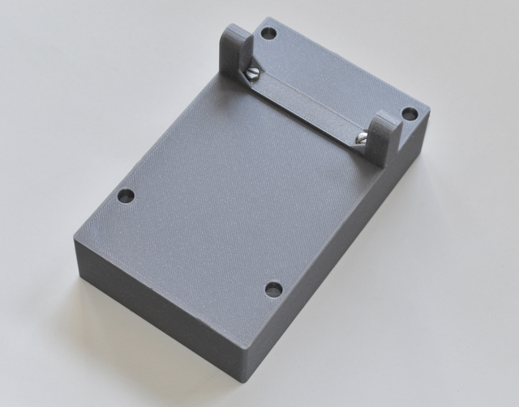

Insert the gCore POTS shield components down, along with the endplate, in the enclosure body and screw the four 20 mm screws from the bottom until they are 10 mm above the PCB.  Add the spacers.

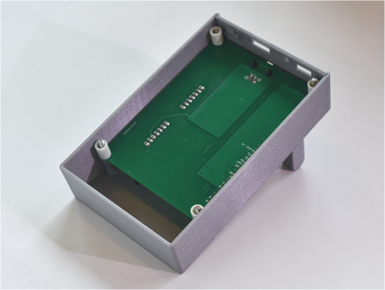

Connect the battery to gCore.  Insert the gCore board, connecting it to the gCore POTS shield.  Make sure the pins are correctly aligned.  Also take care as it's easy to press the gCore power button as you insert it.  Place the battery in the compartment as shown below.  It may be useful to place a small piece of foam over the battery to keep it from rattling around.  Screw the four 20 mm screws so that they are coplanar with the top of the gCore PCB.

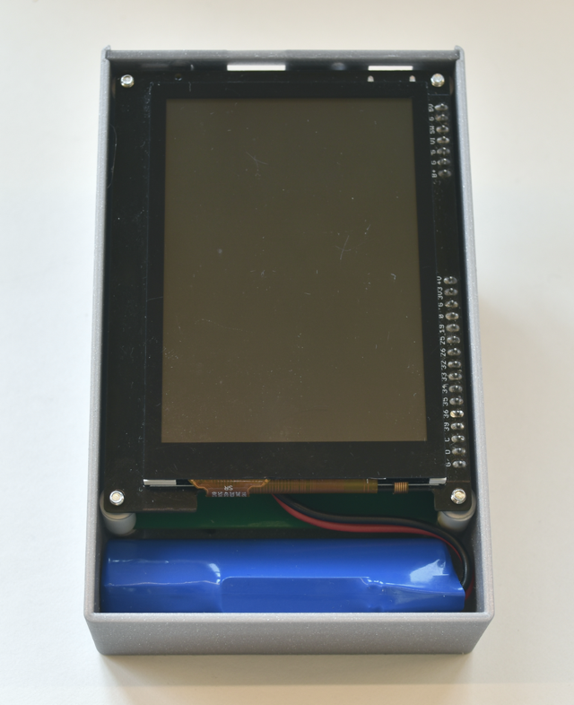

Finally, hold the bezel firmly against the enclosure and screw the four 20 mm screws into the mounts on the underside of the bezel.  Take care not to overtighten as you will twist the mount off the bezel.  It may help to pre-screw the bezel.

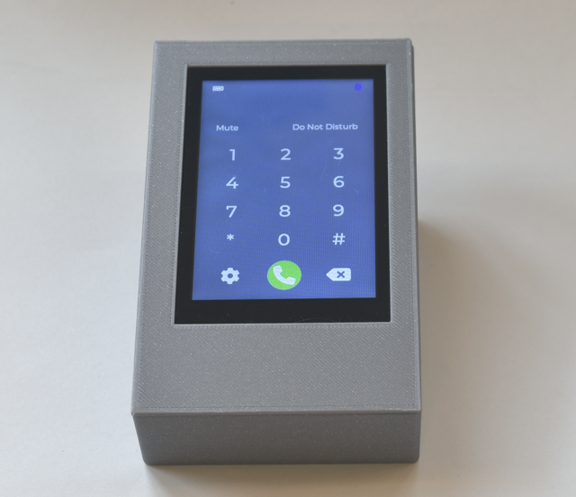

Load the appropriate code on gCore and away you go.  Use a 5V 1A USB-C power supply to normally power the unit.  The battery will act as a back-up (or for portable operation).

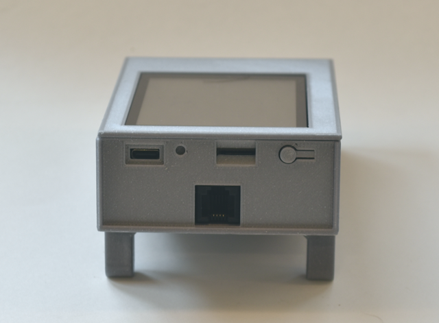